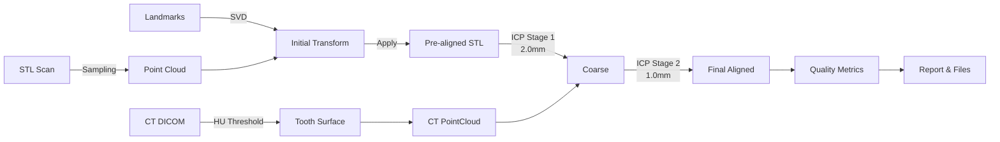

# Dental CT-STL Registration Pipeline

A **stability-first, clinically-viable** registration system for aligning intraoral STL scans to CT coordinate systems for dental implant and surgical planning.

## Features

✅ **Landmark-based SVD registration** - Deterministic, interpretable alignment  
✅ **Interactive landmark picking** - Built-in point selection tool (no external software needed)  
✅ **Two-stage ICP refinement** - 2.0mm → 1.0mm progressive tightening  
✅ **Automatic reflection detection** - Explicit det(R) check prevents left-right flips  
✅ **Quality metrics** - RMSE, inlier ratio, clinical reliability classification  
✅ **Configurable HU threshold** - Adapt to different CT scanner calibrations  
✅ **Complete visualization** - Before/after comparison with high-contrast colors    

---

## Installation

### Prerequisites

- Python 3.8 or higher
- Windows/Linux/macOS
- CT DICOM files + intraoral STL scan

### Setup

```bash
# Clone or navigate to project directory
cd c:\Dental-CT-STL-Registration

# Create virtual environment (recommended)
python -m venv venv
venv\Scripts\activate  # Windows
# source venv/bin/activate  # Linux/macOS

# Install dependencies
pip install -r requirements.txt
```

**Dependencies:**
- `open3d>=0.17.0` - Point cloud processing & visualization (Note: Use Python 3.12 for best compatibility)
- `SimpleITK>=2.3.0` - DICOM reading & marching cubes
- `numpy>=1.24.0` - Numerical operations
- `scipy>=1.11.0` - SVD optimization
- `trimesh>=4.0.0` - Mesh utilities
- `scikit-image>=0.21.0` - Image processing

> **⚠️ Python Version Note:** Use Python 3.12 for best compatibility. Python 3.13 is not yet supported by open3d.

---

## Usage

### Quick Start (Interactive Mode)

**One-command workflow with built-in landmark picking:**

```bash
python main.py --case 2023041102 \
    --landmarks landmarks/2023041102.json \
    --interactive \
    --visualize
```

This will:
1. Load CT and STL data
2. 🆕 **Launch interactive landmark picker** (if landmarks file doesn't exist)
3. Compute SVD registration
4. Refine with two-stage ICP
5. Show before/after visualization

### Standard Usage (Pre-existing Landmarks)

```bash
python main.py --case 2023041102 --landmarks landmarks/2023041102.json --visualize
```

### Command-Line Arguments

| Argument | Required | Default | Description |
|----------|----------|---------|-------------|
| `--case` | ✓ | - | Case name (subdirectory in `data/CASE/cases/`) |
| `--landmarks` | ✓ | - | Path to landmarks JSON file |
| `--interactive` | ✗ | False | 🆕 Launch landmark picker if file doesn't exist |
| `--hu-threshold` | ✗ | 1200 | HU threshold for tooth extraction |
| `--output-dir` | ✗ | `processed` | Output directory for results |
| `--visualize` | ✗ | False | Show visualization windows |
| `--no-icp` | ✗ | False | Skip ICP refinement (landmark-only) |

### Expected Data Structure

```
c:\Dental-CT-STL-Registration\
├── data/CASE/cases/
│   └── [case_name]/
│       ├── DICOM/           # CT DICOM files (*.dcm)
│       └── mandible/        # STL file (*.stl)
├── landmarks/
│   └── [case_name].json     # Landmark coordinates
└── processed/
    └── [case_name]/         # Outputs (created automatically)
```

---

## Landmark Selection

### Method 1: Interactive Landmark Picking (Recommended)

**Built-in tool - no external software needed!**

```bash
python main.py --case 2023041102 \
    --landmarks landmarks/2023041102.json \
    --interactive \
    --visualize
```

**How to pick landmarks:**

1. **CT Window (Red)** opens first:
   - Rotate: Left-click drag
   - Zoom: Mouse scroll
   - Pick point: **SHIFT + Left-click** on anatomical landmark
   - Finish: Press **Q**

2. **STL Window (Green)** opens second:
   - Pick same number of **corresponding** points
   - **Same order** as CT!
   - Press **Q** when done

3. Pipeline automatically continues with registration

### Method 2: Using External Tools

> **💡 可使用 3D Slicer 或 MeshLab 標記後匯出 JSON**  
> Advanced users can use familiar 3D visualization tools for landmark selection.

### Landmark Guidelines

**Requirements:**
- ✅ **Minimum 3 pairs** (4-5 pairs recommended)
- ✅ **Hard tissue only** (enamel surfaces, NOT gingiva)
- ✅ **Distributed** across dental arch (not clustered)
- ✅ **Clearly identifiable** in both CT and STL

**Recommended Anatomical Points:**

| Position | Anatomical Feature | FDI Notation | Priority |
|----------|-------------------|--------------|----------|
| Anterior | Incisal edge of central incisor | 11 or 21 | High |
| Left | Mesiobuccal cusp of first molar | 26 or 36 | High |
| Right | Mesiobuccal cusp of first molar | 16 or 46 | High |
| Optional | Distobuccal cusp of second molar | 17/27 or 47/37 | Medium |

### Landmark JSON Format

```json
{
  "ct_landmarks": [
    [x1, y1, z1],
    [x2, y2, z2],
    [x3, y3, z3]
  ],
  "stl_landmarks": [
    [x1, y1, z1],
    [x2, y2, z2],
    [x3, y3, z3]
  ]
}
```

**Units:** All coordinates in **millimeters (mm)**

---

## Output Files

After successful registration, the pipeline generates:

```
processed/[case_name]/
├── transformation_matrix.txt      # Human-readable 4x4 matrix
├── transformation_matrix.json     # Programmatic format
├── aligned_stl.ply               # Aligned STL point cloud
├── original_stl.ply              # Original STL point cloud
└── ct_teeth.ply                  # Extracted CT tooth surface
```

### Quality Classification

| Classification | RMSE | Inlier Ratio | Action |
|----------------|------|--------------|--------|
| **Highly Reliable ✓** | < 0.8 mm | > 70% | Ready for clinical use |
| **Acceptable** | < 1.5 mm | > 50% | Visual inspection recommended |
| **Failed ✗** | ≥ 1.5 mm | ≤ 50% | Re-select landmarks |

---

## Troubleshooting

### Common Issues

#### 1. **Landmark count < 3**
**Error:** `ValueError: At least 3 landmark pairs required`  
**Solution:** Add more landmarks in JSON file (minimum 3 pairs)

#### 2. **Scale mismatch**
**Symptom:** RMSE > 10mm, grossly misaligned  
**Solution:** Verify both CT and STL use millimeters. Check DICOM spacing.

#### 3. **180° rotation / left-right flip**
**Symptom:** Teeth appear mirrored despite low RMSE  
**Solution:** The pipeline automatically detects and corrects reflections via det(R) check. If problem persists, verify landmark order matches between CT and STL.

#### 4. **Poor tooth extraction**
**Symptom:** Too much/little extracted from CT  
**Solution:** Adjust `--hu-threshold`:
- Too much soft tissue: Increase (try 1300-1500)
- Missing teeth: Decrease (try 1000-1100)
- Different CT scanners may require calibration

#### 5. **ICP divergence**
**Symptom:** Final RMSE worse than landmark RMSE  
**Solution:** 
- Check landmark alignment RMSE (should be < 3mm)
- Use `--no-icp` flag to verify landmark-only registration
- Re-select landmarks if initial alignment is poor

#### 6. **Visualization doesn't open**
**Symptom:** `--visualize` flag has no effect  
**Solution:** Check if running in headless environment. Use remote desktop or save screenshots instead.

---

## Pipeline Workflow



---

## Advanced Usage

### Programmatic Access

```python
from src import run_registration_pipeline

results = run_registration_pipeline(
    dicom_dir='data/CASE/cases/2023041102/DICOM',
    stl_path='data/CASE/cases/2023041102/mandible/GUM.stl',
    landmarks_path='landmarks/2023041102.json',
    output_dir='processed/2023041102',
    hu_threshold=1200,
    visualize=True
)

print(f"RMSE: {results['rmse']:.3f} mm")
print(f"Quality: {results['quality']}")
```

### Integration with Other Tools

The output `transformation_matrix.json` can be loaded in:
- **3D Slicer:** Use Transform module
- **MITK:** Load as ITK transform
- **Custom software:** Parse JSON rotation + translation

---

## Technical Details

### Design Principles

| Priority | Principle | Implementation |
|----------|-----------|----------------|
| 1 | Stability | Landmark-first, constrained ICP |
| 2 | Explainability | Clear stages, detailed logging |
| 3 | Accuracy | Two-stage refinement, quality metrics |

### Key Algorithms

**Procrustes/SVD Registration:**
```
1. Center both landmark sets
2. Compute cross-covariance H = source.T @ target
3. SVD: U, S, Vt = svd(H)
4. Rotation: R = Vt.T @ U.T
5. Check det(R): if -1, flip last column of Vt
6. Translation: t = target_centroid - R @ source_centroid
```

**Two-Stage ICP:**
- Stage 1: `max_dist=2.0mm`, up to 30 iterations
- Stage 2: `max_dist=1.0mm`, up to 50 iterations
- Early stopping if RMSE improvement < 0.01mm

---

## Future Enhancements

*(Not currently implemented)*

-  FPFH feature matching for automatic pre-alignment fallback
-  AI-based automatic landmark detection
-  Multi-resolution ICP with point-to-plane metric
-  Integration API for surgical navigation systems
-  Batch processing for multiple cases

---

## Changelog

### v1.0.0 (2025-12-26)
- ✅ Initial release
- ✅ Landmark-based SVD registration
- ✅ **Interactive landmark picking tool** (integrated into main pipeline)
- ✅ Two-stage ICP refinement
- ✅ Reflection detection and correction
- ✅ Configurable HU threshold
- ✅ Quality metrics and reporting
- ✅ Complete CLI interface
